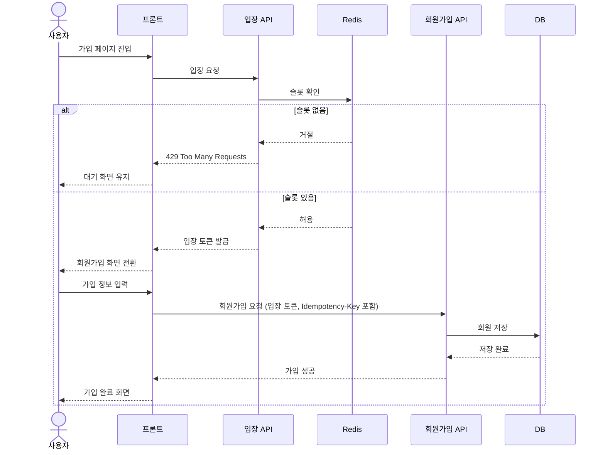

# 설계 결정

설계 과정에서 중요하게 본 기술적 쟁점과 선택 근거를 정리합니다.

## 설계 원칙

- 데이터 정합성은 애플리케이션이 아닌 DB가 최종 책임을 갖도록 설계합니다.
- 인증은 Access Token의 stateless 특성을 유지하면서, 서버에서 회원 상태를 통제할 수 있도록 구성합니다.
- 개인정보는 저장, 조회, 탈퇴 전 과정에서 최소 노출을 기본 원칙으로 합니다.

## 1. 동시 가입과 DB 무결성

### 상황

동일 이메일 또는 동일 휴대폰 번호로 동시에 가입 요청이 발생할 수 있으며, 이 경우에도 중복 데이터 없이 정합성을 보장해야 합니다.

### 선택지

- **A.** DB `UNIQUE` 제약 + 예외 매핑
- **B.** 큐 기반 직렬 처리
- **C.** 사전 조회(`SELECT`) 기반 처리

### 결정

**A를 사용합니다.**

- 이메일과 `phone_hash`에 `UNIQUE` 제약을 적용합니다.
- 제약 위반은 도메인 오류로 변환해 일관된 API 응답을 반환합니다.

### 근거

동일 식별자로 동시 요청이 들어오는 상황에서는 애플리케이션 레벨의 사전 조회만으로 레이스 컨디션을 제거할 수 없습니다.  
정합성은 DB 제약으로 보장하고, 애플리케이션에서는 이를 오류로 변환하는 구조로 구성합니다.

구현 복잡도를 크게 늘리지 않으면서도, DB와 애플리케이션의 책임을 명확하게 나눌 수 있습니다.

- **B. 큐 기반 직렬 처리**는 동일 키 요청을 순차 처리할 수 있지만, 브로커 운영, 재시도, 장애 복구까지 고려해야 하므로 운영 복잡도가 증가합니다.
- **C. 사전 조회 기반 처리**는 읽기와 쓰기 사이 경쟁 상태를 제거할 수 없어, 동시성 상황에서 무결성을 보장하기 어렵습니다.

### 트레이드오프

- 동일 키 요청이 집중될 경우 DB 경합이 증가할 수 있습니다.
- 그 결과 CPU 상승, 락 대기, 응답 지연이 발생할 수 있습니다.
- 요청 유입 제어 구조를 도입할 경우 시스템 복잡도가 증가합니다.

## 2. 트래픽 급증 대응 전략

### 상황

회원가입 API는 외부 이벤트, 마케팅, 오픈 등으로 인해 단기간에 트래픽이 급증할 수 있습니다.  
이 경우 모든 요청을 그대로 처리하면 DB write 구간에서 병목이 발생하고, 시스템 전체가 불안정해질 수 있습니다.

### 선택지

- **A.** 인프라 레벨 Rate Limit + DB 정합성 보장
- **B.** 입장 제어 기반 유입 제어 + DB 정합성 보장
- **C.** 큐 기반 비동기 처리

### 결정

**B를 사용합니다.**

- Redis 기반 입장 제어로 처리 가능한 요청만 선별합니다.
- DB는 최종 정합성만 보장하도록 역할을 제한합니다.

### 근거

회원가입은 결과를 즉시 확인해야 하는 API이므로, 비동기 처리나 지연 응답보다는 요청 유입 자체를 제어하는 방식이 적합합니다.

입장 제어는 Redis를 통해 현재 처리 가능한 슬롯을 기준으로 요청을 선별합니다.  
슬롯 확보에 성공한 요청만 회원가입 API로 진입하고, 초과 요청은 `429 TOO_MANY_REQUESTS`로 즉시 반환됩니다.

Redis를 추가로 운영해야 하는 부담은 있지만, 브로커를 도입하는 방식에 비해 구성과 운영이 단순합니다.  
대기열, 소비자, 재처리 흐름까지 함께 설계해야 하는 구조보다 훨씬 가볍고, 앞단에서 DB 유입을 바로 줄일 수 있어 비용 대비 효과가 큽니다.

프론트엔드는 입장 API를 먼저 호출하여 슬롯 확보 여부를 확인한 뒤, 성공한 경우에만 회원가입 API를 호출합니다.  
슬롯 확보에 실패한 경우(`429`)에는 일정 시간 대기 후 재시도하거나, 사용자에게 대기 상태를 안내합니다.

흐름은 아래와 같습니다.

DB에는 처리 가능한 수준의 요청만 유입되며, 과부하 상황에서도 응답 지연과 오류 확산을 줄일 수 있습니다.

- **A. 인프라 레벨 Rate Limit + DB 정합성 보장**은 전역 또는 IP 단위의 단순 제어에는 효과적이지만, 회원가입 흐름의 현재 상태를 기준으로 세밀하게 제어하기 어렵습니다. 또한 입장 토큰 발급, 재시도 흐름, 사용자별 대기 상태 같은 시나리오를 애플리케이션 맥락에서 다루기 어렵습니다.
- **C. 큐 기반 비동기 처리**는 처리량을 평탄화하는 데는 유리하지만, 사용자에게 즉시 결과를 반환해야 하는 회원가입 API 특성과 맞지 않습니다. 또한 브로커 운영, 재시도, 장애 복구, 중복 소비 제어까지 함께 고려해야 하므로 운영 복잡도가 증가합니다.

해당 구조는 로컬 단일 인스턴스 기준의 부하 테스트에서 확인했으며, 과도한 유입이 들어왔을 때 입장 단계에서 초과 요청을 먼저 차단하는 동작을 확인했습니다.

자세한 결과는 [performance.md](docs/performance.md)에 정리되어 있습니다.

### 트레이드오프

- 초과 요청은 즉시 실패(`429`)하므로 사용자 경험 저하 가능성이 있습니다.
- 입장 정책 설정이 잘못되면 처리량이 과도하게 제한될 수 있습니다.
- 시스템 구성 요소가 증가하여 구조가 복잡해집니다.

## 3. 토큰 전략과 서버 상태 검증

### 상황

인증은 stateless하게 유지하면서도, 로그아웃, 계정 상태 변경, 토큰 탈취 상황에서 서버가 접근을 통제할 수 있어야 합니다.

### 선택지

- **A.** Access Token 단독 사용(긴 TTL)
- **B.** Access + Refresh Token + 서버 상태 검증
- **C.** Access Token 서버 제어 방식 (블랙리스트 / 토큰 버전 등)

### 결정

**B를 사용합니다.**

- Access Token은 stateless하게 사용하고 TTL을 짧게 유지합니다.
- Refresh Token은 DB에 저장하고, revoke 및 rotation을 적용합니다.
- 보호 API에서는 회원 상태(`ACTIVE`)를 함께 검증합니다.

### 근거

Access Token만 사용하는 경우 구조는 단순하지만, 토큰 탈취나 로그아웃 이후에도 만료 시점까지 접근이 가능하다는 문제가 있습니다.

Access Token은 TTL을 짧게 가져가고, Refresh Token은 서버에서 제어할 수 있도록 구성하면 stateless 구조를 유지하면서도 서버 측 통제력을 확보할 수 있습니다.
또한 회원 상태를 DB 기준으로 검증하면, 탈퇴나 비활성화와 같은 상태 변화를 즉시 반영할 수 있습니다.  

회원 상태 조회는 Redis 캐시를 통해 처리하여 DB 조회를 최소화합니다.

- **A. Access Token 단독 사용**은 탈취 시 피해 구간이 길고, 즉시 차단이 어렵습니다.
- **C. Access Token 서버 제어 방식**은 토큰을 즉시 무효화할 수 있지만, 별도 저장소 조회나 상태 관리가 필요해 stateless 구조의 장점이 줄어듭니다.

### 트레이드오프

- Access Token은 즉시 무효화가 어렵고 TTL에 의존합니다.
- 보호 API에서 회원 상태를 함께 검증하는 방식으로 보완합니다.
- Refresh Token은 서버에서 제어할 수 있지만, 저장 및 관리 비용이 추가됩니다.
- 캐시를 사용할 경우, 캐시 불일치에 대한 관리가 필요합니다.

## 4. 개인정보 저장과 노출 정책

### 상황

이메일, 비밀번호, 이름, 휴대폰 번호는 모두 민감 정보로, 저장뿐 아니라 조회, 중복 검증, 탈퇴 이후 처리까지 함께 고려해야 합니다.
특히 휴대폰 번호는 원문 조회와 중복 검증 요구가 동시에 존재합니다.

### 선택지

- **A.** 평문 저장
- **B.** 암호화 + 해시 분리 + 마스킹
- **C.** 전체 암호화

### 결정

**B를 사용합니다.**

- 비밀번호는 `BCrypt`로 해시 처리합니다.
- 이름과 휴대폰 번호는 `AES-GCM`으로 암호화해 저장합니다.
- 중복 검증은 `phone_hash` 컬럼으로 처리합니다.

조회 정책은 다음과 같이 구분합니다.

- 본인 조회: 복호화된 원문 반환
- 관리자 일반 조회: 마스킹된 값 반환
- 관리자 PII 조회: 원문 반환 + 감사 로그 기록

- 이메일은 로그인과 중복 가입 검증에 직접 사용하는 값이므로, 암호화보다 조회 가능성과 `UNIQUE` 제약 적용을 우선합니다.

- 회원 상태 및 일부 조회 데이터는 Redis 캐시를 사용합니다.

- 회원 탈퇴 시 즉시 물리 삭제를 수행하지 않고, 이메일·이름·휴대폰 번호 등 식별 가능한 정보를 비식별화 처리한 뒤 회원 상태를 변경합니다.  
  휴대폰 번호는 해시값 기준 중복 방지를 유지하면서, 원문은 복구할 수 없도록 제거합니다.  
  운영 및 정합성 유지를 위해 최소한의 데이터만 유지하며, 추가 삭제는 정책 또는 배치 작업으로 관리합니다.

### 근거

비밀번호는 복원이 필요 없는 정보이므로 단방향 해시가 적합합니다.  
이름과 휴대폰 번호는 조회 시 복호화가 필요하므로 암호화 저장이 필요합니다.

휴대폰 번호는 중복 검증과 원문 조회 요구가 함께 있으므로, 암호화 컬럼과 해시 컬럼을 분리해 사용합니다.

회원 상태 조회는 Redis 캐시를 통해 처리하고, DB 조회를 줄입니다.  
캐시에 저장되는 값에는 복호화된 정보가 포함될 수 있으므로, Redis는 외부에서 접근할 수 없는 네트워크 영역에 배치합니다.

- **A. 평문 저장**은 유출 시 피해가 크기 때문에 제외합니다.
- **C. 전체 암호화**는 중복 검증과 조건 조회에 불리합니다.

### 트레이드오프

- 복호화 과정에서 민감 정보가 애플리케이션 메모리에 존재할 수 있습니다.
- 캐시에 복호화된 값이 포함될 수 있어, 네트워크 접근 제어가 필요합니다.
- 키 로테이션 시 재암호화 작업이 필요합니다.
- 관리자 원문 조회는 노출 범위를 넓히므로, 감사 로그 관리가 필요합니다.
