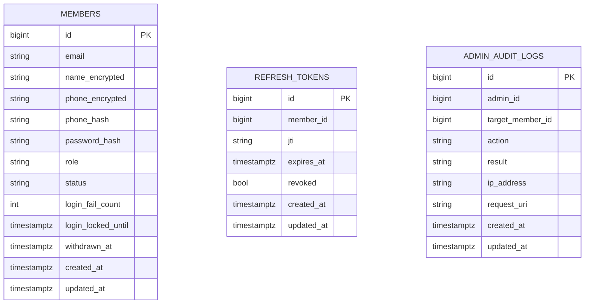

# 회원 플랫폼 서버

회원 도메인을 중심으로 User / Admin 역할을 분리한 API 서버입니다.  
대량 트래픽 환경에서의 **가입 정합성**, **유입 제어**, **개인정보 보호**, **JWT 기반 인증·인가**를 핵심 설계 목표로 합니다.

## 목차

- [1. 주요 기능](#1-주요-기능)
- [2. 기술 스택](#2-기술-스택)
- [3. 프로젝트 구조](#3-프로젝트-구조)
- [4. DB 설계](#4-db-설계)
- [5. API 설계](docs/api.md)
- [6. 보안](docs/security.md)
- [7. 실행 방법](#7-실행-방법)
- [8. 테스트 실행](#8-테스트-실행)
- [9. AI 활용 기록](docs/ai-usage.md)
- [10. 성능 및 부하 테스트 (k6)](docs/performance.md)

## 1. 주요 기능

- **회원 가입 정합성**  
  이메일과 휴대폰 번호는 **DB UNIQUE 제약**으로 관리하며, 동시 요청 상황에서도 데이터 무결성을 유지합니다.

  - Redis 기반 유입 제어를 통해 동시 가입 요청 수를 제한합니다.
  - Idempotency-Key 기반으로 동일 요청의 중복 처리를 방지합니다.

- **인증 / 인가**  
  Access Token은 stateless로 사용하고, Refresh Token은 DB에서 관리합니다.  
  보호 API는 토큰 검증과 함께 회원 상태가 `ACTIVE`인지 확인합니다.

- **개인정보 처리**  
  비밀번호는 BCrypt로 해싱하고, 이름과 휴대폰 번호는 암호화하여 저장합니다.  
  휴대폰 번호 중복 검사는 별도 해시 컬럼으로 처리합니다.

- **PII 노출 정책**   
  개인정보는 최소 노출을 원칙으로 하며, 요청 주체에 따라 노출 범위를 구분합니다.
  
  사용자 본인 조회/수정 API(`GET/PATCH /members/me` 등)에서는 이메일, 이름, 휴대폰 번호를 원문으로 반환합니다.  
  관리자 목록 및 상세 조회에서는 PII를 마스킹하여 제공하며, 원문 조회는 관리자 전용 PII API에서만 허용합니다.

- **관리자 기능**  
  일반 조회와 PII 조회를 분리하고, 관리자 조회 요청은 감사 로그로 기록합니다.

- **계정 보안**  
  로그인 실패 횟수 기준으로 계정 잠금을 적용합니다.

- **캐시 / 장애 대응**  
  조회 빈도가 높은 데이터는 Redis 캐시로 처리하고, 캐시 미스나 장애 시에는 DB 조회로 대체합니다.

- **스키마 관리**  
  DB 스키마 변경은 Flyway로 관리합니다.

- **테스트**  
  단위 테스트와 통합 테스트로 인증, 인가, 동시성 시나리오를 검증합니다.

주요 설계 결정과 선택 근거는 [DECISIONS.md](DECISIONS.md)에 정리합니다.

## 2. 기술 스택

| 구분 | 기술 |
|------|------|
| 언어 | Java 21 |
| 프레임워크 | Spring Boot 3.3.5 |
| 데이터베이스 | PostgreSQL |
| 캐시 | Redis (Spring Cache) |
| 스키마 관리 | Flyway |
| 빌드 | Gradle (멀티 모듈) |

## 3. 프로젝트 구조

모듈형 모놀리식 구조로, 단일 Spring Boot 애플리케이션으로 배포합니다.  
Gradle 멀티 모듈로 도메인 경계를 분리하고, 모듈 간 의존 방향을 고정해 변경 영향 범위를 제한합니다.

### 모듈 구조

```
app/            # 애플리케이션 진입점, 설정, 모듈 조립
member/         # 회원 도메인, 영속, PII 처리
auth/           # 인증, JWT, 로그인/재발급
admin/          # 관리자 API, PII 조회, 감사 로그
common/         # 공통 응답, 예외, 설정
```

### 패키지 구조

패키지는 관심사 기준으로 나누되, 현재 규모에서는 구현 복잡도를 과도하게 높이지 않는 선에서 실용적으로 구성합니다.

```
member/
├── presentation/      # 회원 API, DTO, validation
├── application/       # 회원 유스케이스
├── domain/            # 회원 도메인 모델 및 비즈니스 규칙
└── infrastructure/    # 영속성(JPA), 캐시, 암호화 등 외부 기술 구현

auth/
├── presentation/      # 인증 API, DTO, web(MVC·ArgumentResolver 등)
├── application/       # 로그인, 토큰 발급/갱신 등 인증 유스케이스
├── domain/            # 인증 도메인 모델
├── infrastructure/    # JWT, 로그인 정책, 토큰 저장소 등 구현
└── security/          # Spring Security 설정 및 필터 체인

admin/
├── presentation/      # 관리자 API, 마스킹, AOP, DTO
├── application/       # 관리자 유스케이스
├── domain/            # 관리자 도메인 모델
└── infrastructure/    # 관리자 관련 영속성 구현

common/
├── domain/            # 공통 도메인 요소 (BaseEntity 등)
├── response/          # 공통 응답 포맷 (ApiResponse)
├── exception/         # 공통 예외 처리 및 에러 코드, 핸들러
├── config/            # 전역 설정
└── annotation/        # 공통 어노테이션
```

### 요청 흐름

```
[Client]
   │
   ▼
[Security Filter]  ──── JWT 검증, 회원 상태 확인
   │
   ▼
[Controller]       ──── 요청 파싱, DTO 검증
   │
   ▼
[UseCase]          ──── 비즈니스 조합, 트랜잭션 경계
   │
   ├──▶ [Domain]   ──── 도메인 상태 및 규칙 적용
   │
   └──▶ [Repository / Cache] ──── 영속성 및 조회 최적화 처리
            ├── Redis 캐시 조회 (hit → 반환)
            └── DB fallback (miss → 조회 후 캐시 갱신)
```

> 관리자 API의 PII 조회는 AOP로 감사 로그를 자동 기록합니다.

### 모듈 의존 관계

```
app → common, member, auth, admin
auth → common, member
admin → common, member
member → common
```

- `member`는 다른 기능 모듈에 의존하지 않습니다.
- `auth`와 `admin`은 `member` 위에서 동작합니다.
- `common`은 모든 모듈에서 공통으로 사용합니다.

모듈 의존 규칙은 `./gradlew check`의 `assertModuleDependencyRules`로 검증합니다.

## 4. DB 설계

핵심 테이블은 **회원(`members`)**, **리프레시 토큰(`refresh_tokens`)**, **관리자 감사 로그(`admin_audit_logs`)** 세 가지입니다.

`@EnableJpaAuditing` 및 `@MappedSuperclass BaseEntity`(`@CreatedDate` / `@LastModifiedDate`)로 `created_at`, `updated_at`을 자동 설정합니다.

> **FK 미사용 이유**: 대량 가입 트래픽 환경에서 DB FK는 쓰기 성능에 영향을 주므로, 참조 무결성은 애플리케이션 레벨에서 관리합니다.



### 4.1 members

- **PK**: `id`
- **UNIQUE**: `email`(로그인 식별자), `phone_hash`(휴대폰 번호 중복 검사 — 탈퇴 시 `NULL`로 비워 UNIQUE 충돌 방지)
- **주요 컬럼**
    - `name_encrypted`, `phone_encrypted` — PII 암호문
    - `password_hash` — BCrypt 해시
    - `role` — `USER` / `ADMIN`
    - `status` — `ACTIVE` / `WITHDRAWN`
    - `login_fail_count`, `login_locked_until` — 로그인 잠금
    - `withdrawn_at` — 탈퇴 시각
- **인덱스**: `idx_members_status` (`status`)

### 4.2 refresh_tokens

- **PK**: `id`
- **UNIQUE**: `jti`(토큰 단위 식별·폐기 관리)
- **주요 컬럼**: `member_id`(소유 회원), `expires_at`, `revoked`
- **인덱스**: `idx_refresh_tokens_member_id` (`member_id`)

### 4.3 admin_audit_logs

- **PK**: `id`
- **주요 컬럼**
    - `admin_id`, `target_member_id` — 조회를 수행한 관리자·대상 회원
    - `action`, `result` — 수행 작업·결과
    - `ip_address`, `request_uri` — 요청 정보
- **인덱스**: `idx_audit_admin_id` (`admin_id`), `idx_audit_accessed_at` (`created_at`)

### 4.4 Flyway (스키마 마이그레이션)

- **위치**: `app/src/main/resources/db/migration/`
- **마이그레이션 파일**: `V1__init_schema.sql` — 위 세 테이블과 제약·인덱스를 정의합니다.

> `V1` 내용을 수정한 경우 로컬 DB의 Flyway 체크섬이 어긋납니다. `flyway repair`, `flyway clean`, 또는 Docker 볼륨 초기화로 맞춰 주세요.

- **로컬 / 테스트 / 운영**: PostgreSQL + Flyway + JPA `ddl-auto: validate`
- **로컬 DB 기동**: 루트에서 `docker compose up -d` (PostgreSQL·Redis — `docker-compose.yml`의 DB명·계정·포트 참고)

시각 컬럼은 `TIMESTAMPTZ`(UTC)이며, 애플리케이션에서는 `Instant`로 처리합니다.

## 5. API 설계

엔드포인트, 요청·응답 예시, 오류 코드는 [docs/api.md](docs/api.md)에 정리합니다.

## 6. 보안

인증, 토큰, 개인정보 처리, 관리자 접근 정책은 [docs/security.md](docs/security.md)에 정리합니다.

## 7. 실행 방법

### 로컬

**1. PostgreSQL과 Redis 기동**

```bash
docker compose up -d
```

포트 충돌 시 `docker-compose.yml` 또는 `SPRING_DATASOURCE_URL` 환경 변수를 조정합니다.

**2. 환경 변수 설정**

`env.example`에서 필수 항목을 확인한 뒤 설정합니다.

```bash
cp env.example .env
# .env 편집 후
set -a && source .env && set +a
```

**3. 애플리케이션 실행**

```bash
./gradlew :app:bootRun
```

기본 프로필 `local`, 포트 `8080`입니다. (`SERVER_PORT`로 변경 가능)

### 관리자 계정 (로컬)

관리자 계정은 자동 생성되지 않습니다. 로컬에서는 일반 회원으로 가입한 뒤, DB에서 `role`을 직접 변경해 사용합니다. 

이 방식은 로컬 테스트 편의를 위한 것이며, 운영 환경에서는 별도 관리자 계정 발급 절차가 필요합니다.

### 필수 환경 변수

| 변수 | 설명 |
|------|------|
| `SPRING_DATASOURCE_URL`, `SPRING_DATASOURCE_USERNAME`, `SPRING_DATASOURCE_PASSWORD` | PostgreSQL 접속 정보 |
| `SPRING_DATA_REDIS_HOST`, `SPRING_DATA_REDIS_PORT` | Redis 접속 정보 |
| `JWT_SECRET` | JWT HS256 서명 키 (≥32바이트 권장) |
| `APP_CRYPTO_SECRET` | 이름·휴대폰 번호 암호화 키 |
| `APP_CRYPTO_PHONE_PEPPER` | 휴대폰 번호 해시용 pepper (`APP_CRYPTO_SECRET`과 분리 권장) |

선택 변수: `JWT_ACCESS_SECONDS`, `JWT_REFRESH_SECONDS`, `AUTH_LOGIN_MAX_FAILURES`, `AUTH_LOGIN_LOCK_DURATION`, `CORS_ALLOWED_ORIGINS` — 상세는 `env.example`, `application.yml` 참고.

### DB 마이그레이션

앱 기동 시 Flyway가 `classpath:db/migration`을 자동 적용하므로, 별도로 실행할 필요는 없습니다.

## 8. 테스트 실행

### 단위 테스트

```bash
./gradlew test
```

- Docker가 필요하지 않습니다.
- `*IntegrationTest` 클래스는 각 모듈 `test` 태스크에서 제외됩니다.
- 커버리지 범위: 유스케이스(Mock), 도메인, JWT와 필터, 예외 매핑, 응답 래퍼, 암호화·마스킹

### 통합 테스트

Docker가 필요합니다. Testcontainers로 PostgreSQL, Redis, Flyway를 기동합니다.

```bash
./gradlew :auth:integrationTest :member:integrationTest
```

| 모듈 | 검증 내용 |
|------|-----------|
| `auth` | MockMvc, 보안, JWT, 계정 잠금, 관리자 인가, 감사 로그 |
| `member` | 동시 가입 시나리오, DB 정합성 |

> `app` 모듈의 `integrationTest`는 매칭 테스트가 없어도 실패하지 않습니다.

## 9. AI 활용 기록

AI를 어떤 방식으로 활용했고, 어떤 산출물에 반영했는지는 [docs/ai-usage.md](docs/ai-usage.md)에 정리합니다.

## 10. 성능 및 부하 테스트 (k6)

회원 가입 시나리오 기준의 부하 테스트 방법과 결과 기록은 [docs/performance.md](docs/performance.md)에 정리합니다.
