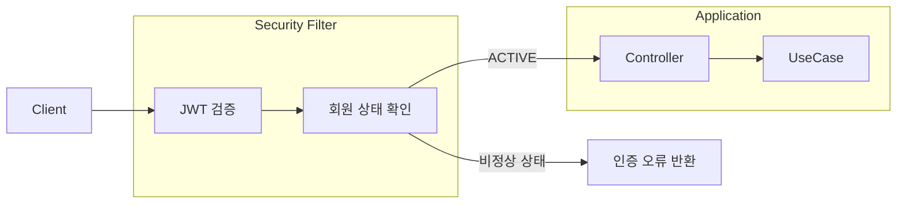

# 보안 및 인증

## 1. 인증 구조

인증은 Access Token 기반의 stateless 구조를 사용하되, Refresh Token을 통해 서버에서 세션을 제어할 수 있도록 구성합니다.

- **Access Token**
  - JWT(HS256), stateless, 짧은 TTL
  - 주요 클레임: `sub`(이메일), `uid`(회원 ID), `typ`, `role`, `roles`, `jti`

- **Refresh Token**
  - DB에 저장하여(`jti`, 만료 시간, `revoked`) 서버에서 유효성을 검증합니다.

- **로그인**
  - Access + Refresh Token을 함께 발급합니다.
  - 기존 Refresh Token은 모두 revoke하여 단일 세션으로 유지합니다.

- **재발급 (Rotation)**
  - 사용된 Refresh Token을 revoke하고, 새로운 Access + Refresh Token을 발급합니다.

- **인증 처리**
  - 이메일은 소문자로 정규화 후 조회합니다.
  - 비밀번호는 BCrypt로 검증합니다.
  - 실패가 누적되면 계정을 잠그고(`login_locked_until`), 성공 시 카운트를 초기화합니다.

## 2. 보호 API 처리

보호 API는 Access Token 검증 이후 회원 상태까지 확인한 뒤 유스케이스를 실행합니다.

요청 흐름

1. Access Token 검증
2. `uid` 클레임에서 회원 ID 추출
3. 회원 상태 확인 (`ACTIVE`)
4. 유스케이스 실행

회원 상태가 ACTIVE가 아니면 `AUTH_INVALID_TOKEN`을 반환합니다.  
상태 조회는 Redis를 우선 사용하고, 장애 발생 시 DB로 fallback 합니다.

- **만료 토큰 예외**
  - 일반 API: `AUTH_EXPIRED_TOKEN` 반환
  - `DELETE /api/v1/auth/token` 요청은 예외적으로 허용합니다.

## 보호 API 흐름

## 3. 세션 제어 (로그아웃 / 탈퇴)

로그아웃과 탈퇴 모두 Refresh Token을 기준으로 세션을 제어합니다.

- **로그아웃**
  - Access Token은 TTL까지 유지됩니다.
  - Refresh Token은 해당 회원 기준으로 전체 revoke 처리합니다.

- **회원 탈퇴**
  - 회원 상태를 `ACTIVE → WITHDRAWN`으로 변경합니다.
  - Refresh Token을 전체 revoke합니다.
  - 이후 모든 보호 API 접근을 차단합니다.

## 4. 개인정보 처리

개인정보는 저장, 조회, 노출 단계에서 각각 다른 방식으로 처리합니다.

- **비밀번호**
  - BCrypt로 해싱하여 저장하며, API로는 노출하지 않습니다.

- **이메일**
  - 평문으로 저장하고 UNIQUE 제약을 적용합니다.
  - 로그인 식별자로 사용합니다.
  - 본인 API에서는 원문을 반환하고, 관리자 조회에서는 마스킹합니다.

- **이름 / 휴대폰 번호**
  - AES-GCM으로 암호화해 저장합니다.
  - 휴대폰 번호는 `phone_hash`로 중복 검증을 처리합니다.
  - 노출 정책은 이메일과 동일하게 적용합니다.

- **응답 정책**
  - 본인 API(`/api/v1/members/me` 등): PII 원문 반환
  - 관리자 목록/상세: 마스킹
  - 관리자 `/pii` API: 원문 반환 (감사 로그 기록)

## 5. 관리자 접근 제어

관리자 기능은 별도 경로와 권한으로 분리합니다.

- `/api/v1/admin/**`는 `ROLE_ADMIN`만 접근 가능합니다.
- PII 조회는 전용 API로 분리합니다.
- 모든 조회 요청은 AOP를 통해 감사 로그로 기록합니다.

## 6. 예외 처리

인증 및 권한 관련 오류는 다음과 같은 코드로 응답합니다.

| 코드 | 설명 |
|------|------|
| AUTH_UNAUTHORIZED | 인증이 필요합니다. |
| AUTH_INVALID_CREDENTIALS | 이메일 또는 비밀번호가 올바르지 않습니다. |
| AUTH_ACCOUNT_LOCKED | 로그인 시도가 너무 많습니다. 잠시 후 다시 시도해 주세요. |
| AUTH_INVALID_TOKEN | 유효하지 않은 토큰입니다. |
| AUTH_EXPIRED_TOKEN | 만료된 토큰입니다. |
| AUTH_FORBIDDEN | 접근 권한이 없습니다. |

## 7. 기타 보안 설정

보안 설정은 인증 구조를 보완하는 방향으로 구성합니다.

- **Spring Security**
  - CSRF 비활성 (API 환경)
  - 세션 STATELESS
  - CORS: 허용 Origin 제한

- **접근 정책**
  - `/api/v1` 외 경로는 기본적으로 denyAll 처리합니다.

- **비밀 관리**
  - JWT Secret, 암호화 키, pepper는 환경 변수로 관리합니다.
  - 운영 환경에서는 KMS 사용을 권장합니다.

- **Rate Limit**
  - 회원가입과 같이 트래픽 제어가 필요한 API는 입장 제어로 처리하고, 일반적인 Rate Limit은 인프라 레벨에서 처리합니다.

- **로그 정책**
  - 엔티티 및 PII는 로그에 출력하지 않습니다.
